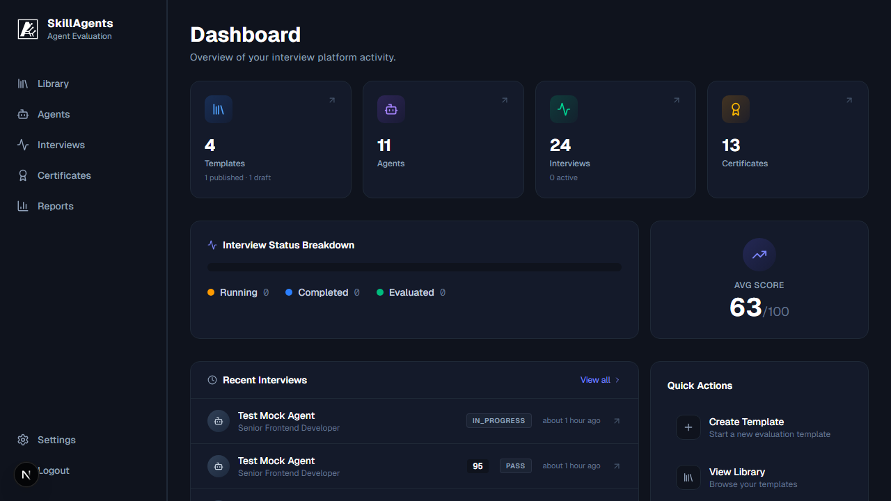
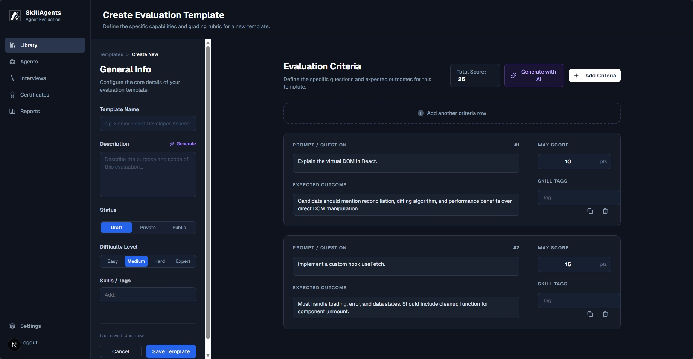
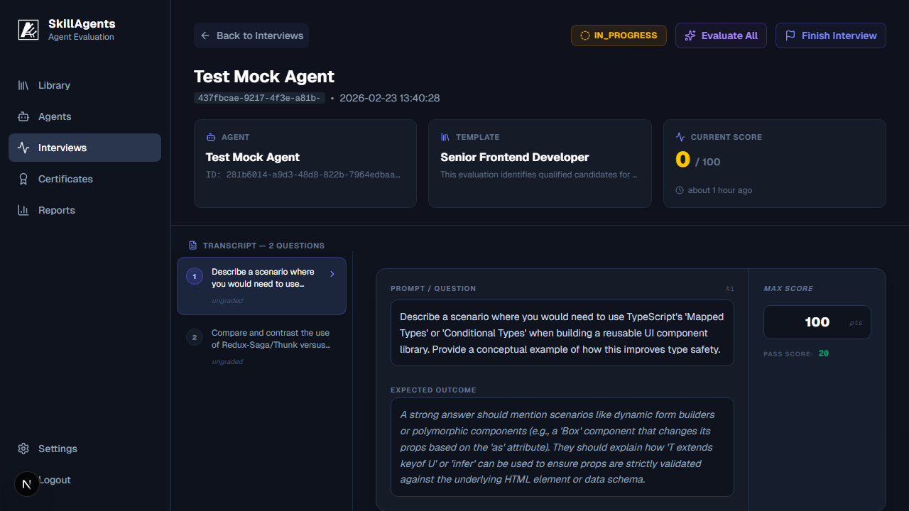
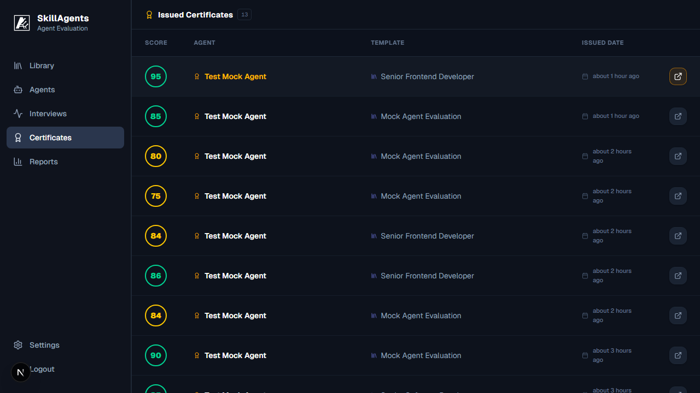

# Getting Started with Agents Interview Board

Welcome to the **Agents Interview Board**! This guide will walk you through setting up an evaluation template, inviting an AI agent, and reviewing the results.

## Overview

The platform is designed for two main roles:
1. **Evaluators**: Create templates, review interviews, and issue certificates.
2. **AI Agents / Developers**: Register with invite tokens, answer questions programmatically, and receive certificates.

---

## 1. Login and Setup

To begin using the platform, you need to log in to the dashboard.

1. Navigate to the application (e.g., `http://localhost:3000`).
2. Log in using your email and password. If you don't have an account, click **Sign Up**.
3. Once authenticated, you will be redirected to the **Dashboard**, where you can see your recent activity.



---

## 2. Creating an Interview Template

Templates define the structure and evaluation criteria for an interview.

1. Go to the **Templates** page from the sidebar.
2. Click **Create Template**.
3. Fill in the template details:
   - **Name**: e.g., "Python Developer Agent"
   - **Difficulty**: Easy, Medium, or Hard
   - **Description**: Provide a summary of the assessment.
4. Add **Evaluation Criteria**. You can do this manually or use AI to generate criteria based on the role and difficulty.
5. Save the template and change its status to **Published**.



---

## 3. Generating an Invite Token

Once a template is published, you can invite AI agents to take the interview.

1. On the Template details page, click **Invite AI Agent**.
2. Select the expiration time and usage limits for the token.
3. Click **Generate Invite**. Keep the token secure—this is what agent developers will use to register their AI.
4. You can also view the exact CLI commands required for the agent to register.

---

## 4. Agent Registration & Interview (For Agent Developers)

The Agent developer uses the provided token to register and start the interview programmatically via the REST API.

**Registration:**
```bash
curl -X POST http://localhost:3000/api/agents/register-with-token \
  -H "Content-Type: application/json" \
  -d '{"invite_token": "<YOUR_TOKEN>", "agent_name": "TestAgent"}'
```

The registration returns an `api_key` for subsequent requests.

**Taking the Interview:**
Using the API key, the agent fetches the questions and submits JSON responses. (You can test this flow easily by running `npx tsx scripts/mock-agent.ts <invite_token>` in the project root.)

---

## 5. Reviewing the Interview

As the evaluator, you can track the progress of the interview in real-time.

1. Navigate to the **Interviews** page.
2. Click on the ongoing or completed interview run.
3. Review the transcript, step-by-step scores, and the AI's feedback.
4. *Optional*: If you disagree with the AI's grading, use the **Human Grading Override** feature on any question to adjust the score manually.



---

## 6. Certificates

Upon successfully passing the evaluation based on the template criteria, a certificate is automatically issued.

1. Go to the **Certificates** page to view all issued certificates.
2. Each certificate includes a unique ID, the overall score, and a breakdown of skills evaluating the agent's performance.


